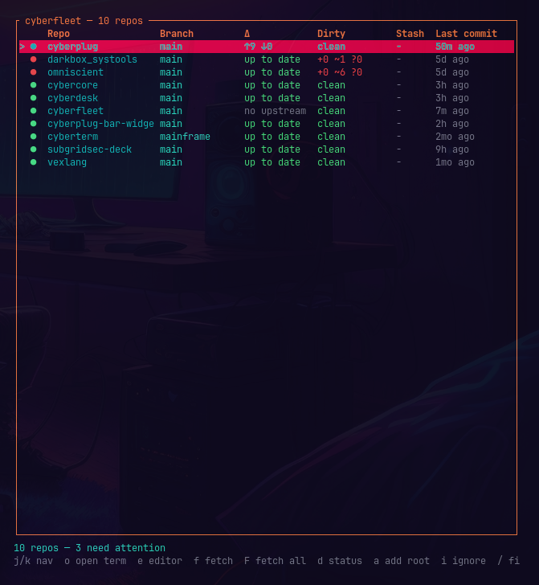

# cyberfleet

A multi-repo git status dashboard for Omarchy — see every repo that needs
attention (dirty, unpushed, behind, mid-rebase) from the bar, drill into a
full TUI to fetch, diff, and jump in. Built for people who work out of more
than one repo at a time and are tired of `cd`-ing into each one to remember
which ones they forgot about.

Ships as an Omarchy bar widget. One command installs the widget **and** the
manager binary.



## Install

```bash
omarchy plugin add https://github.com/cybercore-tech/cyberfleet.git --enable
```

Click the bar icon. That's it — first launch scans a shortlist of common dev
directory names under `$HOME` (`Devspace`, `dev`, `Developer`, `projects`,
`code`, `.sysops`, `workspace`, `Documents/GitHub`, `repos`, ...) for ones
that actually exist, and uses those as a starting point. Add or remove roots
any time with `a` in the TUI, or by editing the config directly (see below).

The plugin checkout includes a bundled `cyberfleet` binary for
`linux-x86_64`. On other architectures, the launcher builds this same
checkout's source with `cargo build --locked` the first time you click it
(cached under `bin/` after) if `cargo` is available — it never downloads or
executes a prebuilt artifact from the network.

## Remove

```bash
omarchy plugin remove io.github.darkstardevx.cyberfleet
```

## The bar widget

Shows a live count of repos that need attention (dirty, unpushed/behind, or
mid-merge/rebase), refreshed every 60 seconds from a fast, **local-only**
scan — no network fetch runs automatically, so the bar never blocks on a
slow or offline remote. Click it to open the full dashboard.

## The dashboard (TUI)

```
j/k, ↑/↓    move
/           filter by name
o, Enter    open a terminal at the selected repo
e           open $EDITOR (or $VISUAL, falling back to nvim) there
f           fetch the selected repo
F           fetch every repo
d           show `git status` for the selected repo
a           add a root directory to scan
i           ignore the selected repo (by name)
r           rescan all configured roots
?           toggle the help popup
q, Esc      quit (Esc closes a popup first)
```

Repos needing attention always sort to the top. Two checkouts that happen to
share a directory name (say, one root's `foo` and another's) are shown with
their parent directory so you can tell them apart.

### About `f` / `F` (fetch)

`git fetch` against an SSH remote can need a passphrase or a host-key
confirmation. Rather than swallow that prompt somewhere you'll never see it
(or worse, hang the whole app — that's a real bug this project found and
fixed during development), fetching **suspends the TUI entirely** and hands
you a real terminal: you'll see normal `git fetch` output and can answer any
prompt exactly like you would running it yourself, then press Enter to
return to the dashboard. One consequence: Ctrl-C during a stuck prompt exits
cyberfleet itself rather than just cancelling that one fetch — same as
Ctrl-C on a plain `git fetch` you ran directly, since the TUI has
deliberately handed the terminal's normal signal behavior back for exactly
that moment.

## Config

`~/.config/cyberfleet/config.json`:

```json
{
  "roots": ["~/Devspace", "~/.sysops"],
  "ignore": ["node_modules", "target", "vendor", ".cache", "dist", "build"],
  "max_depth": 4
}
```

- `roots` — directories to scan for repos (`~` is expanded). Edit directly,
  or add one from the TUI with `a`.
- `ignore` — directory *names* skipped during scanning (also used by `i` in
  the TUI, which appends the selected repo's name).
- `max_depth` — how many directory levels deep to look for a `.git` inside
  each root.

## How it works

Local status (branch, ahead/behind, staged/unstaged/untracked counts, stash
count, and merge/rebase/cherry-pick-in-progress detection — the thing plain
`git status` buries in a paragraph of prose that's easy to skim past) comes
from `git2` (libgit2) directly — no shelling out, no output-parsing, fast
enough to scan a few dozen repos without feeling it. The two operations that
need your real credentials or tooling — `git fetch` and opening a terminal
or editor — shell out to the actual `git`/`$TERMINAL`/`$EDITOR` binaries
instead of reimplementing auth or terminal detection, so they behave exactly
like running them yourself.

## Developer install (rebuild binary)

```bash
git clone https://github.com/cybercore-tech/cyberfleet.git
cd cyberfleet
./install.sh
```

That rebuilds a release binary into `bin/linux-$(arch)/cyberfleet` (and
optionally `~/.local/bin` for CLI use outside the bar, via `--local-bin`).

## CLI

```bash
cyberfleet             # open the dashboard
cyberfleet --summary   # print {"attention":N,"total":N} and exit (bar widget uses this)
cyberfleet --help
```

## Requirements

Omarchy with the Quattro shell. No network needed to launch on
`linux-x86_64` (bundled binary); other architectures need `cargo`/Rust
installed once to build this checkout's own source on first launch. `git`
must be on `$PATH` for fetch/status/detail; an SSH agent with your key
loaded avoids a passphrase prompt on every fetch.

## Docs

- [SECURITY.md](SECURITY.md) — how to report a vulnerability
- [STATEMENT.md](STATEMENT.md) — how this project is built, AI's role in it

## License

MIT
